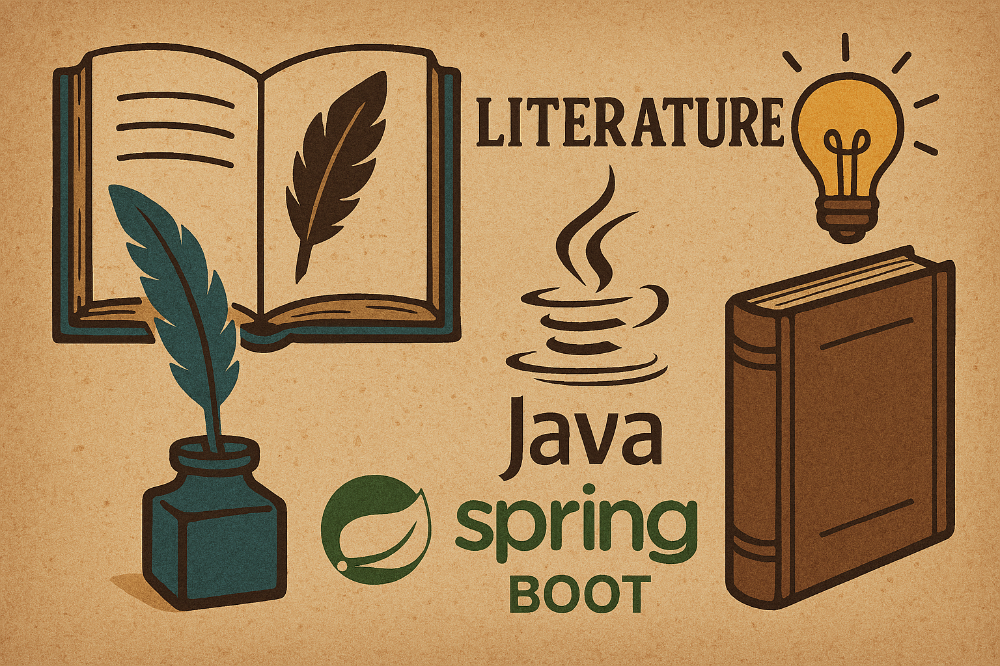
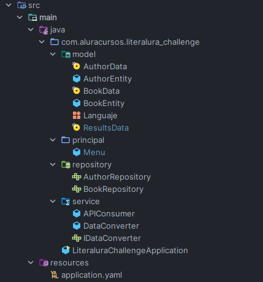

# 📚 LiterAlura - Challenge Alura Latam


##  Descripción del Proyecto
**LiterAlura** es un catálogo de libros interactivo que permite la gestión de literatura mediante el consumo de la API de **Gutendex**. El sistema permite buscar libros por título, persistirlos en una base de datos relacional y realizar consultas avanzadas sobre autores y sus obras. 

El enfoque principal es la aplicación de la **Programación Orientada a Objetos (POO)**, la persistencia de datos con **Spring Data JPA** y la integración de servicios externos siguiendo los principios de **Clean Code**.

---

## Metodología de Trabajo
Se utilizó la metodología **Kanban** para la gestión ágil del proyecto, permitiendo un flujo de trabajo continuo y visual.

* **🗂 Herramienta utilizada:** [Trello](https://trello.com/b/WDyMPDMb/literalura-challenge-java)
* **Columnas empleadas:**
    * `Backlog`: Ideas y requerimientos pendientes.
    * `En Desarrollo`: Tareas en implementación actual.
    * `Pausado`: Funcionalidades pospuestas.
    * `Concluido`: Tareas finalizadas.

---

## Tecnologías Utilizadas

### 🛠 Stack Tecnológico
| Tecnología | Versión / Detalle |
| :--- | :--- |
| **Java** | 21 (LTS) |
| **Spring Boot** | 4.0.3 |
| **Spring Data JPA** | Gestión de persistencia |
| **PostgreSQL** | Base de datos relacional |
| **Jackson** | 2.13.2 |
| **Gradle** | Gestor de dependencias |

### ⚙️ Configuración del Proyecto (build.gradle)
```groovy
plugins {
    id 'java'
    id 'org.springframework.boot' version '4.0.3'
    id 'io.spring.dependency-management' version '1.1.7'
}

group = 'com.aluracursos'
version = '0.0.1-SNAPSHOT'
description = 'Project for Alura'

java {
    toolchain {
       languageVersion = JavaLanguageVersion.of(21)
    }
}

dependencies {
    implementation 'org.springframework.boot:spring-boot-starter'
    implementation 'com.fasterxml.jackson.core:jackson-databind:2.20.1'
    implementation 'org.springframework.boot:spring-boot-starter-data-jpa'
    runtimeOnly 'org.postgresql:postgresql'
}
```

## 🏗 Arquitectura del Proyecto

El sistema sigue una arquitectura desacoplada en capas:
Cada capa tiene una responsabilidad clara:

| Capa | Responsabilidad |
|------|----------------|
| `Main` | Punto de entrada de la aplicación ('CommandLineRunner'). Orquestación del menú y captura de datos del usuario. |
| `service` | Lógica de procesamiento de datos, incluyendo el convertidor de JSON ('DataConverter') y la gestión de reglas de negocio. |
| `repository` | Interfaces que extienden de 'JpaRepository' para realizar operaciones CRUD y consultas personalizadas en 'PostgreSQL'. |
| `Client` | Manejo de la comunicación HTTP externa a través de la clase 'APIConsumer'. |
| `model` | RDefinición de Entidades JPA ('BookEntity', 'AuthorEntity') para persistencia y Records ('BookData', 'AuthorData') para el mapeo de la API. |

## Configuración de 'application.yml'
```
spring:
  application:
    name: literalura-challenge

  datasource:
    url: jdbc:postgresql://${DB_HOST}/biblioteca_alura
    username: ${DB_USER}
    password: ${DB_PASSWORD}
    driver-class-name: org.postgresql.Driver

  jpa:
    hibernate:
      ddl-auto: update
    show-sql: true
    properties:
      hibernate:
        dialect: org.hibernate.dialect.PostgreSQLDialect
        format_sql: true
```

## 📂Estructura de Carpetas



## 🌍 API Utilizada
El proyecto consume la API de 'Gutendex', un catálogo abierto que proporciona acceso a los libros del Proyecto Gutenberg.

Endpoint Base: 'https://gutendex.com/books/'
Método de Búsqueda: Se utiliza el parámetro '?search=' para filtrar por título o autor.
Formato de Datos: JSON estructurado con soporte para paginación y filtrado por metadatos.

## Sistema En Ejecucion
1 
